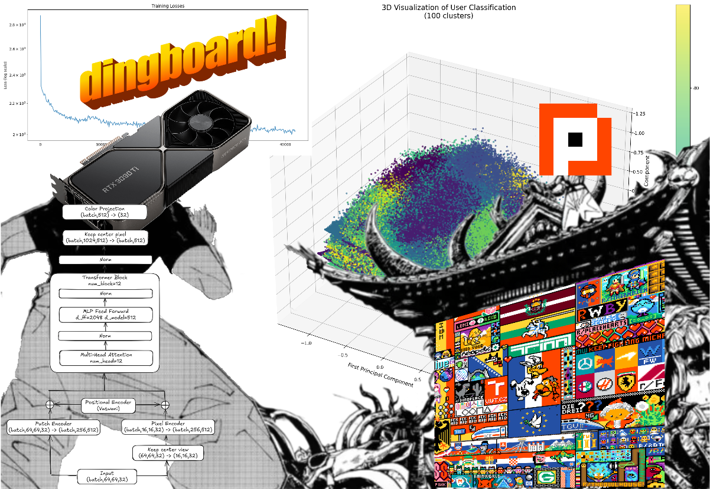
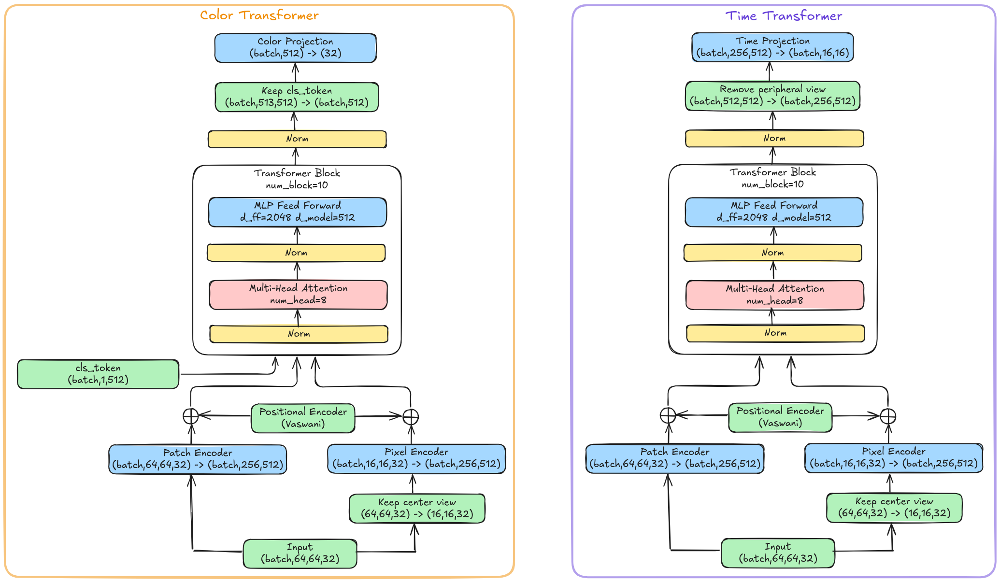
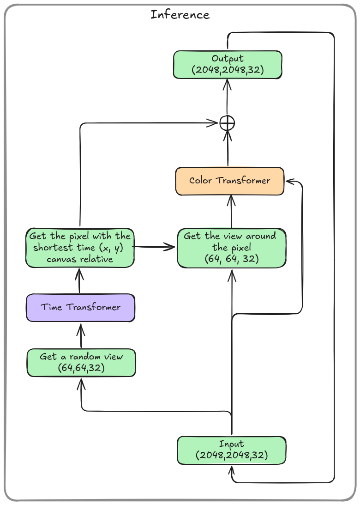

# R/Place Vision Transformer(s)

This repository contains the code my experiments with Vision Transformers (ViTs) on the R/Place dataset of 2022.  
The R/Place dataset is a big CSV file containing every pixel change made to the Reddit Place canvas.  
The dataset is available [here](https://www.reddit.com/r/place/comments/txvk2d/rplace_datasets_april_fools_2022/).

## 
Dataset Processing

The dataset is first processed with a [tiny rust tool](data_processing/src/main.rs). It download / convert the CSV file to a series of sqlite partitions who is way faster to query than going through the whole CSV file every time we want to reproduce the canvas at a given time.

Then for Pytorch the [dataset](rplacevit/dataset.py) is a quite complex one, but not everything is used in it, from some old experiments. Basically he instantiate the sqlite connection, and return the 64x64 canvas views around a pixel change at a given time. Then this Dataset is extended to the ColorDataset class, which the target is the future color of the pixel in the center of the canvas, and the TimeDataset class, which the target is the time before a pixel change for every pixel in the 16x16 view.

## 
Model(s)

The [model](rplacevit/model.py) is a Vision transformer, who use a mix of 4x4 patch input and pixel input.

[An Image is Worth 16x16 Words: Transformers for Image Recognition at Scale](https://arxiv.org/abs/2010.11929)

[An Image is Worth More Than 16×16 Patches: Exploring Transformers on Individual Pixels](https://arxiv.org/abs/2406.09415)

## 
Inference

The [inference](rplacevit/inference.py) can apply the model on a image for N steps, then save the result in mp4 and gif format.  
There is a lot of arguments I recommend to take a look at the file.

## 
Training

The model can be trained with the [train](rplacevit/train.py) script, here again, a lot of arguments are available.  

The loss function for the ColorModel is a simple cross entropy loss, and for the TimeModel is a simple MSELoss (squared L2 norm).  
AdamW with 0.001 learning rate is what worked best for me.

The model can be train on a tiny GPU if you reduce the hidden size and the number of layers, and it support multi-gpu training. If you enable the peripheral view, the CPU will be the bottleneck due to the sqlite queries.

During my experiments, the models were trained on hundreds if GPUs hours. Not a lot of epochs were trained due to the millions of steps per epoch.

## 
Results

Not a lot of exciting results were obtained, I don't know if it's because it's impossible to predict the future of the canvas, if it's the model architecture, if it's the scaling, or even the approach.

If you want to see some results you can check my [first blog post on that project](https://jlsquare.fr/rplace-vision-transformer)

If you want to experiment with the model, I recommend to train it on a small subset of the dataset, got args for that, and to use the inference script to see the results.

I'm not sure if I will continue to work on this project for now, but if you make some questions, interesting ideas, discoveries, or improvements, feel free to contact me on [X dot com](https://x.com/jlsquare_) or [Discord](https://discord.com/users/378927976991031296) :)